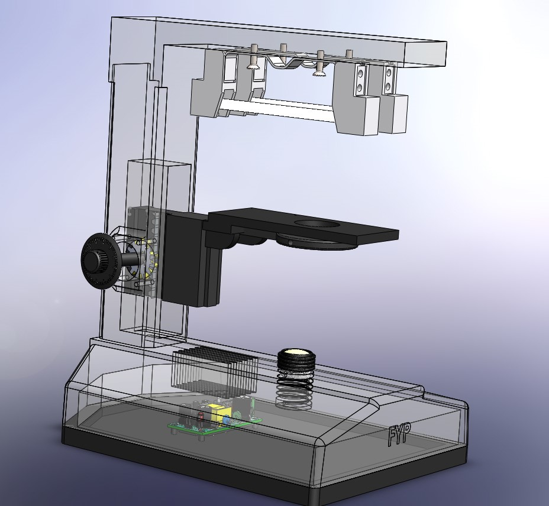
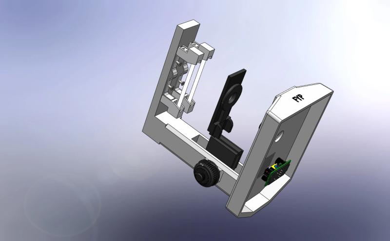
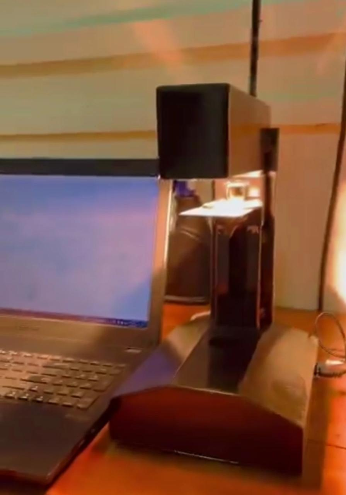

<!-- https://www.linkedin.com/posts/kalana-mihiranga_thermalpropertymeasurement-dataanalysis-softwaredevelopment-activity-7093981821389975552-o4eK?utm_source=share&utm_medium=member_desktop -->

# <b>Laser Flash Instrument</b>

Light Flash Instrument consist with 2 major components.Electronic circuit and software components to operate and analyze its data

    

    

    

